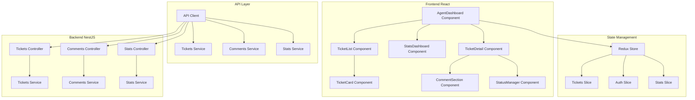

# Document de Conception - Dashboard Agent

## Vue d'Ensemble

Le Dashboard Agent est une interface web moderne construite avec React et Tailwind CSS, intégrée au backend NestJS existant. L'architecture suit les principes de séparation des préoccupations avec des composants réutilisables, une gestion d'état centralisée, et une communication efficace avec l'API backend via des appels REST authentifiés par JWT.

L'interface est optimisée pour la productivité des agents avec une navigation rapide, des actions en lot, et une mise à jour en temps réel des données. Le design suit les meilleures pratiques UX pour les dashboards de support technique, privilégiant la clarté visuelle et l'efficacité opérationnelle.

## Architecture

### Architecture Globale



### Patterns Architecturaux

**Container-Presentational Pattern**: Séparation claire entre les composants logiques (containers) qui gèrent l'état et les appels API, et les composants de présentation (presentational) qui se contentent d'afficher les données.

**Module Pattern**: Organisation du code en modules fonctionnels (tickets, comments, stats) avec leurs propres services, types, et composants.

**Observer Pattern**: Utilisation de Redux pour la gestion d'état réactive avec des mises à jour automatiques de l'interface.

## Composants et Interfaces

### Composants Principaux

#### AgentDashboard (Container)
- **Responsabilité**: Composant racine orchestrant l'ensemble du dashboard
- **État**: Gestion de la vue active, filtres globaux, état de chargement
- **Props**: Aucune (composant racine)
- **Hooks**: useSelector pour l'état Redux, useEffect pour l'initialisation

#### TicketList (Container)
- **Responsabilité**: Affichage et gestion de la liste des tickets
- **État**: Filtres, tri, sélection multiple, pagination
- **Props**: `tickets: Ticket[]`, `loading: boolean`, `onTicketSelect: (id: string) => void`
- **Fonctionnalités**: Tri, filtrage, sélection multiple, actions en lot

#### TicketCard (Presentational)
- **Responsabilité**: Affichage individuel d'un ticket dans la liste
- **Props**: `ticket: Ticket`, `selected: boolean`, `onSelect: () => void`, `onStatusChange: (status: TicketStatus) => void`
- **Design**: Card Tailwind avec indicateurs visuels de priorité et statut

#### TicketDetail (Container)
- **Responsabilité**: Vue détaillée d'un ticket avec historique et actions
- **État**: Ticket sélectionné, commentaires, état d'édition
- **Props**: `ticketId: string`
- **Fonctionnalités**: Modification statut/priorité, ajout commentaires, historique

#### StatsDashboard (Presentational)
- **Responsabilité**: Affichage des métriques et statistiques
- **Props**: `stats: DashboardStats`
- **Composants**: Cartes de métriques, graphiques, indicateurs KPI

#### CommentSection (Container)
- **Responsabilité**: Gestion des commentaires d'un ticket
- **État**: Liste commentaires, nouveau commentaire, état soumission
- **Props**: `ticketId: string`, `comments: Comment[]`

### Interfaces TypeScript

```typescript
interface Ticket {
  id: string;
  title: string;
  description: string;
  status: TicketStatus;
  priority: TicketPriority;
  clientId: string;
  clientName: string;
  assignedAgentId?: string;
  assignedAgentName?: string;
  createdAt: Date;
  updatedAt: Date;
  lastCommentAt?: Date;
}

enum TicketStatus {
  OPEN = 'open',
  IN_PROGRESS = 'in_progress',
  RESOLVED = 'resolved',
  CLOSED = 'closed'
}

enum TicketPriority {
  LOW = 'low',
  MEDIUM = 'medium',
  HIGH = 'high',
  CRITICAL = 'critical'
}

interface Comment {
  id: string;
  ticketId: string;
  authorId: string;
  authorName: string;
  authorRole: 'client' | 'agent';
  content: string;
  createdAt: Date;
  isInternal: boolean;
}

interface DashboardStats {
  totalTickets: number;
  ticketsByStatus: Record<TicketStatus, number>;
  ticketsByPriority: Record<TicketPriority, number>;
  averageResolutionTime: number;
  myAssignedTickets: number;
  myResolvedToday: number;
}

interface TicketFilters {
  status?: TicketStatus[];
  priority?: TicketPriority[];
  assignedAgent?: string;
  client?: string;
  dateRange?: {
    start: Date;
    end: Date;
  };
  searchQuery?: string;
}
```

### Services API

#### TicketsService
```typescript
class TicketsService {
  async getAllTickets(filters?: TicketFilters): Promise<Ticket[]>
  async getTicketById(id: string): Promise<Ticket>
  async updateTicketStatus(id: string, status: TicketStatus): Promise<Ticket>
  async updateTicketPriority(id: string, priority: TicketPriority): Promise<Ticket>
  async assignTicket(id: string, agentId: string): Promise<Ticket>
  async bulkUpdateStatus(ticketIds: string[], status: TicketStatus): Promise<void>
}
```

#### CommentsService
```typescript
class CommentsService {
  async getTicketComments(ticketId: string): Promise<Comment[]>
  async addComment(ticketId: string, content: string, isInternal: boolean): Promise<Comment>
}
```

#### StatsService
```typescript
class StatsService {
  async getDashboardStats(): Promise<DashboardStats>
  async getAgentStats(agentId: string): Promise<AgentStats>
}
```

## Modèles de Données

### Structure Redux Store

```typescript
interface RootState {
  auth: {
    user: Agent | null;
    token: string | null;
    isAuthenticated: boolean;
  };
  tickets: {
    items: Ticket[];
    selectedTicket: Ticket | null;
    filters: TicketFilters;
    loading: boolean;
    error: string | null;
  };
  comments: {
    byTicketId: Record<string, Comment[]>;
    loading: boolean;
  };
  stats: {
    dashboard: DashboardStats | null;
    loading: boolean;
    lastUpdated: Date | null;
  };
}
```

### Gestion d'État avec Redux Toolkit

**Tickets Slice**: Gestion des tickets avec actions pour charger, filtrer, mettre à jour, et sélectionner les tickets.

**Comments Slice**: Gestion des commentaires avec cache par ticket et mise à jour optimiste.

**Stats Slice**: Gestion des statistiques avec rafraîchissement automatique et cache temporisé.

## Correctness Properties

*Une propriété est une caractéristique ou un comportement qui doit être vrai dans toutes les exécutions valides d'un système - essentiellement, une déclaration formelle sur ce que le système devrait faire. Les propriétés servent de pont entre les spécifications lisibles par l'homme et les garanties de correction vérifiables par machine.*

### Propriété 1: Affichage Global des Tickets
*Pour tout* agent authentifié, l'accès au dashboard doit retourner tous les tickets existants dans le système, indépendamment du client propriétaire
**Valide: Exigences 1.1, 1.2**

### Propriété 2: Complétude des Informations de Ticket
*Pour tout* ticket affiché, le rendu doit contenir au minimum le statut, la priorité, le nom du client et la date de création
**Valide: Exigences 1.3**

### Propriété 3: Tri des Tickets par Critères
*Pour toute* liste de tickets et tout critère de tri (date, priorité, statut), l'application du tri doit retourner les tickets dans l'ordre correct selon le critère spécifié
**Valide: Exigences 1.4**

### Propriété 4: Filtrage selon Critères
*Pour tout* ensemble de critères de filtrage et toute liste de tickets, l'application des filtres doit retourner uniquement les tickets correspondant à tous les critères (opérateur ET)
**Valide: Exigences 1.5, 7.2**

### Propriété 5: Validation des Transitions de Statut
*Pour tout* ticket et toute demande de changement de statut, le système doit accepter uniquement les transitions valides selon le workflow (open → in_progress → resolved → closed) et rejeter les transitions invalides
**Valide: Exigences 2.2, 2.5**

### Propriété 6: Traçabilité des Modifications
*Pour toute* modification de ticket (statut, priorité, assignation), le système doit enregistrer automatiquement l'horodatage de la modification et l'identifiant de l'agent responsable
**Valide: Exigences 2.3, 3.3, 8.3**

### Propriété 7: Notifications de Changement de Statut
*Pour tout* ticket passant au statut "resolved", le système doit déclencher une notification au client propriétaire du ticket
**Valide: Exigences 2.4**

### Propriété 8: Notifications d'Assignation
*Pour tout* ticket assigné à un agent, le système doit déclencher une notification à l'agent concerné
**Valide: Exigences 3.4**

### Propriété 9: Complétude des Commentaires
*Pour tout* ticket consulté, l'affichage doit inclure tous les commentaires existants associés à ce ticket
**Valide: Exigences 4.1**

### Propriété 10: Métadonnées des Commentaires
*Pour tout* commentaire ajouté, le système doit enregistrer automatiquement l'horodatage, l'identifiant de l'auteur et son rôle
**Valide: Exigences 4.2**

### Propriété 11: Notifications de Commentaires
*Pour tout* commentaire ajouté par un agent, le système doit déclencher une notification email au client propriétaire du ticket
**Valide: Exigences 4.3**

### Propriété 12: Ordre Chronologique des Commentaires
*Pour tout* affichage de commentaires, ils doivent être ordonnés chronologiquement par date de création (du plus ancien au plus récent)
**Valide: Exigences 4.4**

### Propriété 13: Validation des Commentaires
*Pour tout* commentaire soumis, le système doit rejeter les commentaires vides ou composés uniquement d'espaces
**Valide: Exigences 4.5**

### Propriété 14: Calcul des Statistiques par Statut
*Pour tout* accès au dashboard, les statistiques affichées doivent refléter le nombre exact de tickets pour chaque statut dans le système
**Valide: Exigences 5.1**

### Propriété 15: Calcul du Temps Moyen de Résolution
*Pour toute* demande de statistiques, le temps moyen de résolution calculé doit correspondre à la moyenne arithmétique des durées entre création et résolution de tous les tickets résolus
**Valide: Exigences 5.2**

### Propriété 16: Répartition par Priorité
*Pour tout* affichage de métriques, la répartition par priorité doit refléter le nombre exact de tickets pour chaque niveau de priorité
**Valide: Exigences 5.3**

### Propriété 17: Filtrage par Agent
*Pour tout* filtre appliqué sur un agent spécifique, seuls les tickets assignés à cet agent doivent être retournés
**Valide: Exigences 5.4, 7.3**

### Propriété 18: Actions en Lot
*Pour toute* sélection multiple de tickets et toute action en lot, l'action doit être appliquée à tous les tickets sélectionnés et uniquement à ceux-ci
**Valide: Exigences 6.2**

### Propriété 19: Recherche Multi-Champs
*Pour toute* requête de recherche, le système doit examiner le titre, la description et le contenu des commentaires de tous les tickets
**Valide: Exigences 7.1**

### Propriété 20: Filtrage par Plage de Dates
*Pour tout* filtre de date appliqué, seuls les tickets créés dans la plage spécifiée doivent être retournés
**Valide: Exigences 7.4**

### Propriété 21: Tri par Priorité
*Pour tout* tri appliqué sur la priorité, les tickets doivent être ordonnés selon la hiérarchie : critique, haute, moyenne, basse
**Valide: Exigences 8.5**

<function_calls>
<invoke name="prework">
<parameter name="featureName">agent-dashboard

## Gestion d'Erreurs

### Stratégies de Gestion d'Erreurs

**Erreurs de Validation**: Validation côté client avec feedback immédiat et validation côté serveur pour la sécurité. Messages d'erreur contextuels et actions correctives suggérées.

**Erreurs Réseau**: Retry automatique avec backoff exponentiel, mode dégradé avec cache local, et notifications utilisateur pour les échecs persistants.

**Erreurs d'Autorisation**: Redirection automatique vers la page de connexion, gestion des tokens expirés avec refresh automatique.

**Erreurs de Données**: Validation des réponses API, gestion des données manquantes ou corrompues, fallbacks avec valeurs par défaut.

### Codes d'Erreur Spécifiques

- **TICKET_NOT_FOUND**: Ticket demandé n'existe pas
- **INVALID_STATUS_TRANSITION**: Transition de statut non autorisée
- **UNAUTHORIZED_ASSIGNMENT**: Agent non autorisé à assigner ce ticket
- **COMMENT_VALIDATION_FAILED**: Commentaire vide ou invalide
- **BULK_ACTION_PARTIAL_FAILURE**: Certaines actions en lot ont échoué

## Stratégie de Tests

### Approche de Tests Duale

Le système utilise une approche combinant tests unitaires et tests basés sur les propriétés pour une couverture complète :

**Tests Unitaires** : Vérifient des exemples spécifiques, cas limites et conditions d'erreur
- Tests d'intégration entre composants
- Cas limites et conditions d'erreur
- Exemples spécifiques démontrant le comportement correct

**Tests de Propriétés** : Vérifient les propriétés universelles sur tous les inputs
- Couverture complète des inputs via randomisation
- Validation des propriétés de correction universelles

### Configuration des Tests de Propriétés

**Bibliothèque**: fast-check pour JavaScript/TypeScript
**Itérations**: Minimum 100 itérations par test de propriété
**Étiquetage**: Chaque test de propriété doit référencer sa propriété du document de conception
**Format d'étiquette**: **Feature: agent-dashboard, Property {number}: {property_text}**

### Tests de Propriétés Spécifiques

Chaque propriété de correction doit être implémentée par UN SEUL test basé sur les propriétés :

- **Propriété 1**: Test que getAllTickets() retourne tous les tickets sans filtrage par client
- **Propriété 5**: Test des transitions de statut valides/invalides avec génération aléatoire
- **Propriété 12**: Test de l'ordre chronologique avec commentaires générés aléatoirement
- **Propriété 19**: Test de recherche multi-champs avec requêtes et données aléatoires

### Équilibrage des Tests Unitaires

Les tests unitaires se concentrent sur :
- Exemples spécifiques démontrant le comportement correct
- Points d'intégration entre composants React et services API
- Cas limites et conditions d'erreur
- Éviter trop de tests unitaires - les tests de propriétés gèrent la couverture des nombreux inputs

Les tests de propriétés se concentrent sur :
- Propriétés universelles valables pour tous les inputs
- Couverture complète des inputs via randomisation