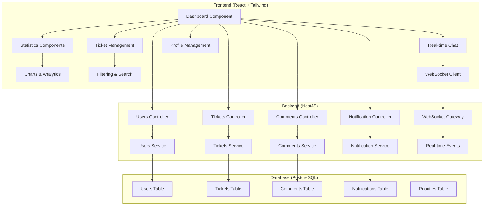

# Design Document: Client Dashboard Enhancement

## Overview

Cette spécification technique définit l'amélioration du dashboard client existant pour créer une interface moderne, intuitive et professionnelle utilisant Tailwind CSS. Le système s'appuie sur l'architecture React + NestJS + PostgreSQL existante et ajoute des fonctionnalités temps réel, des statistiques avancées, et une expérience utilisateur optimisée.

L'objectif principal est de transformer le dashboard actuel en une interface moderne qui respecte les standards d'accessibilité et offre une expérience utilisateur fluide sur tous les appareils.

## Architecture

### Architecture Globale



### Stack Technique

**Frontend:**
- React 19.2.3 (existant)
- Tailwind CSS (configuré)
- React Router DOM 7.12.0 (existant)
- Axios pour les appels API (existant)
- WebSocket client pour le temps réel

**Backend:**
- NestJS (existant)
- TypeORM (existant)
- PostgreSQL (existant)
- WebSocket Gateway pour le temps réel
- JWT Authentication (existant)

## Components and Interfaces

### Composants Frontend Principaux

#### 1. Enhanced Dashboard Component
```typescript
interface DashboardProps {
  user: User;
}

interface DashboardState {
  tickets: Ticket[];
  statistics: DashboardStats;
  notifications: Notification[];
  loading: boolean;
  filter: TicketFilter;
}

interface DashboardStats {
  totalTickets: number;
  openTickets: number;
  inProgressTickets: number;
  resolvedTickets: number;
  averageResponseTime: number;
  resolutionTrends: ChartData[];
}
```

#### 2. Statistics Components
```typescript
interface StatCardProps {
  title: string;
  value: number;
  icon: string;
  color: string;
  trend?: number;
  onClick?: () => void;
}

interface ChartComponentProps {
  data: ChartData[];
  type: 'line' | 'bar' | 'pie';
  title: string;
}
```

#### 3. Advanced Ticket Management
```typescript
interface TicketListProps {
  tickets: Ticket[];
  filter: TicketFilter;
  onFilterChange: (filter: TicketFilter) => void;
  onTicketSelect: (ticket: Ticket) => void;
}

interface TicketFilter {
  status?: TicketStatus[];
  priority?: Priority[];
  dateRange?: DateRange;
  searchQuery?: string;
  category?: string[];
}
```

#### 4. Real-time Chat System
```typescript
interface ChatComponentProps {
  ticketId: number;
  messages: Message[];
  onSendMessage: (content: string, attachments?: File[]) => void;
}

interface Message {
  id: number;
  content: string;
  author: User;
  timestamp: Date;
  attachments?: Attachment[];
  type: 'text' | 'system' | 'file';
}
```

### Interfaces Backend

#### 1. Enhanced Tickets Service
```typescript
interface TicketsService {
  findAllForUser(userId: number): Promise<Ticket[]>;
  getStatistics(userId: number): Promise<DashboardStats>;
  getResolutionTrends(userId: number, period: string): Promise<ChartData[]>;
  updateTicket(id: number, data: UpdateTicketDto): Promise<Ticket>;
}
```

#### 2. Real-time WebSocket Gateway
```typescript
interface WebSocketGateway {
  handleConnection(client: Socket): void;
  handleDisconnect(client: Socket): void;
  joinTicketRoom(ticketId: number, client: Socket): void;
  broadcastTicketUpdate(ticketId: number, update: TicketUpdate): void;
  sendNotification(userId: number, notification: Notification): void;
}
```

#### 3. Notification Service
```typescript
interface NotificationService {
  createNotification(data: CreateNotificationDto): Promise<Notification>;
  getNotificationsForUser(userId: number): Promise<Notification[]>;
  markAsRead(notificationId: number): Promise<void>;
  sendEmailNotification(userId: number, template: string, data: any): Promise<void>;
}
```

## Data Models

### Enhanced User Model
```typescript
interface User {
  id: number;
  name: string;
  email: string;
  role: 'client' | 'agent' | 'admin';
  avatar?: string;
  preferences: UserPreferences;
  createdAt: Date;
  updatedAt: Date;
}

interface UserPreferences {
  emailNotifications: boolean;
  pushNotifications: boolean;
  theme: 'light' | 'dark';
  language: string;
  notificationFrequency: 'immediate' | 'hourly' | 'daily';
}
```

### Enhanced Ticket Model
```typescript
interface Ticket {
  id: number;
  title: string;
  description: string;
  status: TicketStatus;
  priority: Priority;
  category: string;
  user: User;
  assignedAgent?: User;
  comments: Comment[];
  attachments: Attachment[];
  timeline: TimelineEvent[];
  estimatedResolution?: Date;
  actualResolution?: Date;
  satisfactionRating?: number;
  createdAt: Date;
  updatedAt: Date;
}

type TicketStatus = 'open' | 'in_progress' | 'resolved' | 'closed';

interface TimelineEvent {
  id: number;
  type: 'created' | 'status_changed' | 'assigned' | 'commented' | 'resolved';
  description: string;
  user: User;
  timestamp: Date;
  metadata?: any;
}
```

### Comment and Chat Models
```typescript
interface Comment {
  id: number;
  content: string;
  author: User;
  ticket: Ticket;
  attachments: Attachment[];
  isInternal: boolean;
  createdAt: Date;
  updatedAt: Date;
}

interface Attachment {
  id: number;
  filename: string;
  originalName: string;
  mimeType: string;
  size: number;
  url: string;
  uploadedBy: User;
  createdAt: Date;
}
```

### Notification Model
```typescript
interface Notification {
  id: number;
  type: NotificationType;
  title: string;
  message: string;
  user: User;
  relatedTicket?: Ticket;
  isRead: boolean;
  metadata?: any;
  createdAt: Date;
}

type NotificationType = 'ticket_update' | 'new_comment' | 'status_change' | 'assignment' | 'resolution';
```

## Correctness Properties

*A property is a characteristic or behavior that should hold true across all valid executions of a system-essentially, a formal statement about what the system should do. Properties serve as the bridge between human-readable specifications and machine-verifiable correctness guarantees.*

### Correctness Properties

Basées sur l'analyse prework des critères d'acceptation, voici les propriétés de correction consolidées :

**Property 1: Personalized Dashboard Display**
*For any* authenticated user, when accessing the dashboard, the welcome message should contain the user's name and display complete statistics (total, open, in-progress, resolved tickets, response times, and trend charts)
**Validates: Requirements 1.1, 1.2, 1.3, 1.4**

**Property 2: Real-time Updates**
*For any* data change (ticket updates, new comments, status changes), all connected clients should receive updates immediately without requiring page refresh
**Validates: Requirements 1.5, 3.1, 4.2**

**Property 3: Ticket Creation and Validation**
*For any* ticket creation attempt, the form should contain all required fields (title, description, priority, category), validate input correctly, and create tickets immediately when valid
**Validates: Requirements 2.1, 2.2**

**Property 4: Advanced Filtering and Search**
*For any* ticket collection and search query, the filtering system should correctly filter by status, priority, date, category, provide intelligent search across titles/descriptions, and support sorting by date, priority, and status
**Validates: Requirements 2.3, 2.4, 2.5**

**Property 5: Ticket Detail Display**
*For any* ticket selection, the detail view should display complete ticket information including interaction history and timeline
**Validates: Requirements 2.6, 3.4**

**Property 6: Communication System**
*For any* comment or message, the chat system should support file attachments, rich text formatting, and display all communications in real-time to relevant parties
**Validates: Requirements 3.5**

**Property 7: Notification System**
*For any* ticket event (updates, comments, status changes), notifications should be sent according to user preferences (push and email) and stored for later access
**Validates: Requirements 3.2, 3.3**

**Property 8: Timeline and Tracking**
*For any* ticket action, the timeline should record all actions with timestamps and responsible parties, display chronologically, and show estimated resolution times when available
**Validates: Requirements 4.1, 4.3, 4.5**

**Property 9: Satisfaction Rating**
*For any* ticket resolution, the rating system should prompt the client for satisfaction feedback
**Validates: Requirements 4.4**

**Property 10: Profile Management**
*For any* profile update (personal information, notification preferences, password, security settings), changes should be saved immediately with confirmation and maintain complete interaction history
**Validates: Requirements 5.1, 5.2, 5.3, 5.4, 5.5**

**Property 11: Responsive Design and Accessibility**
*For any* viewport size (mobile, tablet, desktop), the dashboard should maintain proper layout, consistent styling, smooth animations, and WCAG 2.1 AA compliance
**Validates: Requirements 6.1, 6.2, 6.3, 6.4**

**Property 12: Theme Support**
*For any* theme selection (light/dark), when the feature is available, the dashboard should apply the theme consistently across all components
**Validates: Requirements 6.6**

**Property 13: System Integration**
*For any* operation, the dashboard should integrate seamlessly with the existing NestJS backend, use the existing PostgreSQL schema without breaking changes, maintain data consistency, preserve authentication/authorization, and maintain backward compatibility
**Validates: Requirements 7.1, 7.2, 7.3, 7.4, 7.5**

## Error Handling

### Frontend Error Handling

**Network Errors:**
- Implement retry mechanisms for failed API calls
- Display user-friendly error messages for network issues
- Provide offline mode indicators when connection is lost
- Cache critical data for offline access

**Validation Errors:**
- Real-time form validation with clear error messages
- Prevent submission of invalid data
- Highlight problematic fields with specific error descriptions
- Maintain form state during error correction

**Authentication Errors:**
- Automatic token refresh for expired sessions
- Graceful redirect to login when authentication fails
- Preserve user's work during re-authentication
- Clear security-related error messages

### Backend Error Handling

**Database Errors:**
- Transaction rollback for failed operations
- Connection pool management for database issues
- Graceful degradation when database is unavailable
- Data integrity validation before commits

**WebSocket Errors:**
- Automatic reconnection for dropped connections
- Message queuing during connection issues
- Fallback to polling when WebSocket fails
- Connection state management and recovery

**File Upload Errors:**
- File size and type validation
- Virus scanning for uploaded files
- Storage quota management
- Cleanup of failed uploads

## Testing Strategy

### Dual Testing Approach

Le système utilisera une approche de test double combinant tests unitaires et tests basés sur les propriétés :

**Unit Tests:**
- Tests spécifiques pour les cas d'usage critiques
- Tests d'intégration entre composants React
- Tests des points d'API backend
- Tests des cas limites et conditions d'erreur
- Tests d'accessibilité avec des outils automatisés

**Property-Based Tests:**
- Tests des propriétés universelles avec génération de données aléatoires
- Validation des propriétés de correction définies ci-dessus
- Tests de performance avec charges variables
- Tests de compatibilité cross-browser
- Tests de responsive design avec différentes tailles d'écran

### Configuration des Tests Basés sur les Propriétés

**Framework:** Jest avec fast-check pour JavaScript/TypeScript
**Iterations:** Minimum 100 itérations par test de propriété
**Tag Format:** Chaque test de propriété sera tagué avec :
```javascript
// Feature: client-dashboard-enhancement, Property 1: Personalized Dashboard Display
```

**Couverture des Tests:**
- Tests unitaires : Cas spécifiques, intégrations, erreurs
- Tests de propriétés : Comportements universels, génération de données
- Tests E2E : Parcours utilisateur complets
- Tests de performance : Temps de chargement, réactivité
- Tests d'accessibilité : Conformité WCAG 2.1 AA

### Outils de Test

**Frontend:**
- Jest + React Testing Library pour les tests unitaires
- fast-check pour les tests basés sur les propriétés
- Cypress pour les tests E2E
- axe-core pour les tests d'accessibilité
- Lighthouse pour les tests de performance

**Backend:**
- Jest pour les tests unitaires NestJS
- Supertest pour les tests d'API
- fast-check pour les tests de propriétés backend
- Artillery pour les tests de charge

La stratégie de test garantit une couverture complète avec des tests unitaires pour les cas spécifiques et des tests de propriétés pour valider les comportements universels du système.